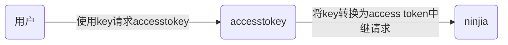
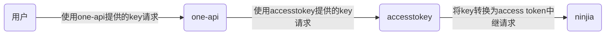

# **accessToken-to-apiKey**

本项目对接的是[ninjia](https://github.com/gngpp/ninja)项目，可以使chatgpt的access token转换成key的形式，给某些无法写入access token当key用的服务使用，如[one-api](https://github.com/songquanpeng/one-api)等

## 特色

1.  web端管理

## 部署

基于node部署

1.  在mysql创建一个名为accesstokey的数据库(建议使用phpmyadmin或mysql workbench)
2.  进入该数据库，创建一个表名为channel的数据表，拥有以下字段

    | 列名        | 数据类型         | 约束(&分割)        | 默认值 |
    | :-------- | :----------- | :------------- | :-- |
    | id        | INT          | PK\&NN\&UQ\&AI |     |
    | name      | VARCHAR(45)  | NN             |     |
    | access    | TEXT         | NN             |     |
    | session   | TEXT         |                |     |
    | key       | VARCHAR(255) | PK\&NN\&UQ     |     |
    | status    | TINYINT      |                | 1   |
    | timestamp | BIGINT       |                |     |
3.  将仓库克隆下来后修改config.js文件，使后端能连接上你的数据库及ninjia请求地址


```markdown
# 将代码克隆到本地
git clone https://github.com/wu-shanglin/accessToken-to-apiKey.git

#构建前端
cd accessToken-to-apiKey/accesstokey-web
npm install
npm run build

#运行后端
cd ..
npm install
node index.js
```

## 使用方法

##### **将请求accesstokey的地址改为http\://youdomain:4090/api，后面要带上/api**

登陆后点击添加按钮，填入access token,完成后会生成一个key，该key与openai的sk-key类似，使用该key将请求带入accesstokey，它会将Authorization的Bearer key自动转换成Authorization Bearer再向ninjia请求

#### 下图是单独使用的效果



#### 下图是配合one-api使用的效果，one-api可以实现统一资源调配，但由于某种原因无法支持access token，可以通过accesstokey解决



